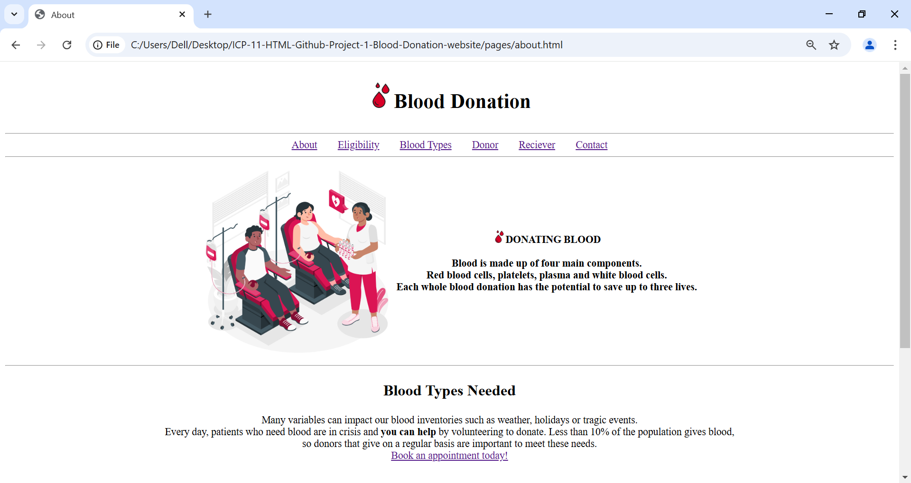
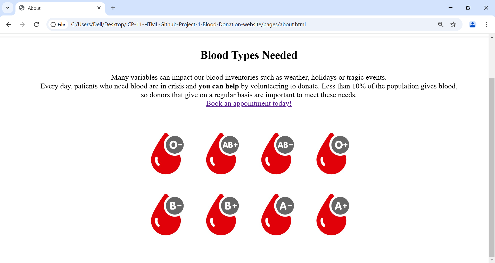

# Blood Donation 🩸

[Visit Blood Donation Website📌](https://github.com/Shravanikuldharan/ICP-11-HTML-Github-Project-1-Blood-Donation-website)

## Overview🌐

The **Blood Donation Website** is an HTML-based project designed to spread awareness about blood donation. It provides crucial information about blood types, eligibility criteria, and the donation process. The website also includes login sections for donors and recipients.

---

## Features✅
1. Home Page – Overview of blood donation and its importance.
2. About Page – Detailed information on blood components and benefits.
3. Eligibility Page – Criteria for donors to ensure safe donations.
4. Blood Types Page – Information on blood type compatibility.
5. Donor & Receiver Login – Secure login for users.
6. Contact Page – Get in touch for more information.
 
---
## Homepage 

---

## Purpose of the Website
- Educate users about blood donation benefits.
- Guide potential donors on eligibility requirements.
- Provide information on different blood groups and their compatibility.
- Facilitate easy donor registration and login.
- Help connect blood donors with recipients in times of emergency.

*This website serves as a life-saving platform by encouraging more people to donate blood and supporting healthcare systems in maintaining sufficient blood supplies.❤️*

---

## Real use of project
*This project can be used by **hospitals,** **NGOs,** and **healthcare** organizations to encourage and manage blood donations efficiently.*
 
----
## Our Contributors

Thanks to these amazing people for their contributions!  

---

## Contact
Email📧: donateblood@gmail.com

Github📌: https://github.com/Shravanikuldharan

